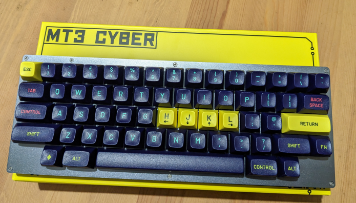

# My keymap for HHKB HS60 V2

Default layer is normal HHKB with 7U space. Fn layer is used for RGB functions, Volume control and arrow cluster.

All I have done is add autoshift and move the modifiers and navigation keys to where I expect them to be.

I will write more about this keyboard once I have done some more experiments.
