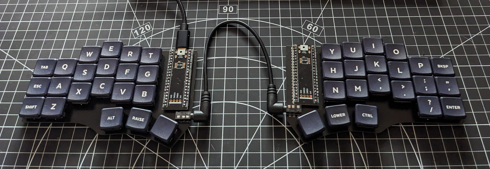

# Cantor

My keymap is mostly the same as the Corne, but there is also  a keymap in this directory that can be imported into Vial and applied to a keyboard already running the [Vial firmware](https://github.com/vial-kb/vial-qmk).

## Build guide

I'm working on a [build guide](https://github.com/teknostatik/keyboards/blob/main/cantor/cantor_build_guide.md) which I will add to as I learn more. I suspect I will build more, as I _really_ like what they are capable of at such a low price point.

