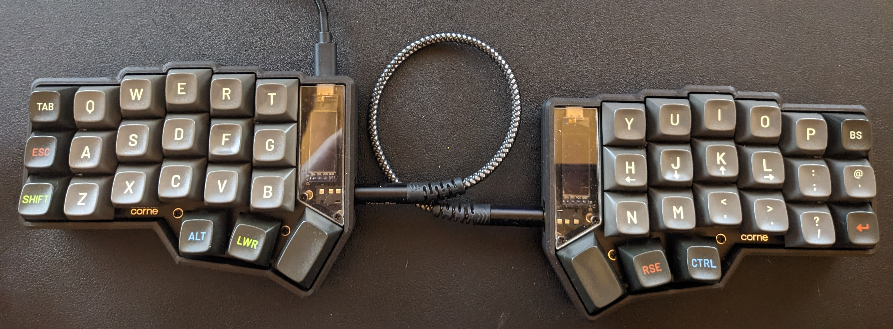

# Notes on my Corne Configuration

The Corne is a 42-key mechanical keyboard. These are my notes on building and configuring it. Largely for my own benefit.

The Corne I started with is the RTG model, ordered from [Mechboards](https://mechboards.co.uk/). I have also now built a few from scratch, using whatever the cheapest kit Mechboards sell is. 

Currently I'm using [this case](https://www.etsy.com/uk/listing/1179555093/high-profile-corne-3dp-case) which make it look a lot better, as well as being significantly more stable on my desk. I've also now screwed the original base on to the bottom to give even more stability.

This is my daily driver currently:

And this is my first attempt at soldering:

Generally I'll use _Susuwatari_ keycaps on a black board and _dev/tty_ on a white board (both MT3 profile). Both of these are available from Drop, and are usually in stock. 

I'm close to getting the [keymap](https://github.com/teknostatik/keyboards/blob/main/corne/keymap.c) how I want it, although it is still a work in progress, The defaults are sensible, but I want this to be interchangeable with the Planck and so I have moved a few things around and added macros for things I do often.

As with all my keyboards, I'm using `AUTO_SHIFT_ENABLE` to remove the need to use a modifier when I am typing normal text.

I have used this periodically for over a year, and it's been my main keyboard since June 2022.

If you're using my firmware, the command to flash a Pro-micro or Elite-C would be:

        qmk flash -kb crkbd/rev1 -km teknostatik

For the Elite-Pi (which I will probably use in all my builds going forward) the command would be

        qmk flash -c -kb crkbd/rev1 -km teknostatik -e CONVERT_TO=elite_pi

