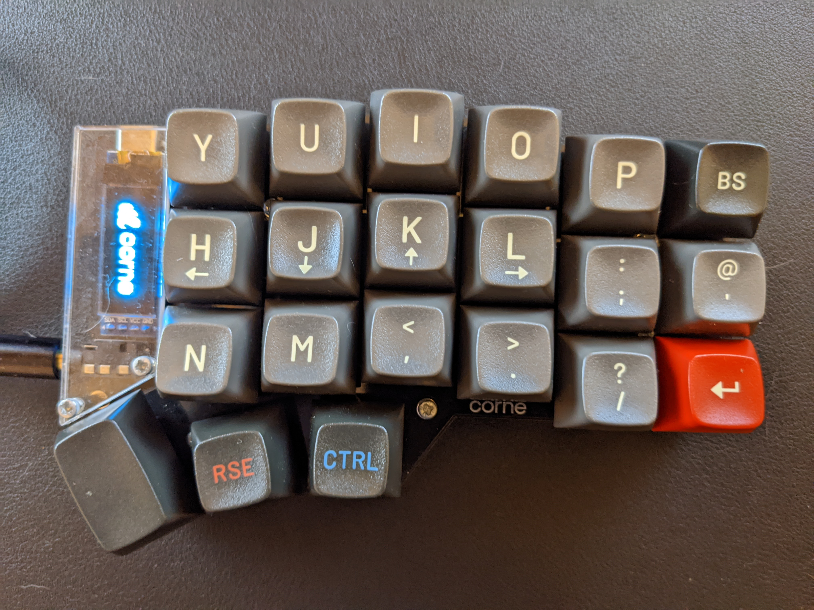

# Notes on my Corne Configuration

_The Corne is a 42-key mechanical keyboard. These are my notes on building and configuring it. Largely for my own benefit._

The Corne I'm using is the RTG model, ordered from [Mechboards](https://mechboards.co.uk/). I am currently part way through building one from scratch as well though.

Currently I'm using the [this case](https://www.etsy.com/uk/listing/1179555093/high-profile-corne-3dp-case) which make it look a lot better, as well as being significantly more stable on my desk.

This is what my keyboard currently looks like:

I'm close getting the keymap how I want it, although it is still a work in progress, The defaults are sensible, but I want this to be interchangeable with the Planck and so I have moved a few things around and added macros for things I do often.

On this side there is a number pad on a layer, plus additional functionality hidden below the modifiers.

On this side I have navigation on one layer, and commonly used symbols on another.

As with all my keyboards, I'm using `AUTO_SHIFT_ENABLE` to remove the need to use a modifier when I am typing normal text.

I have used this periodically for a few months, and it is currently my main keyboard.
