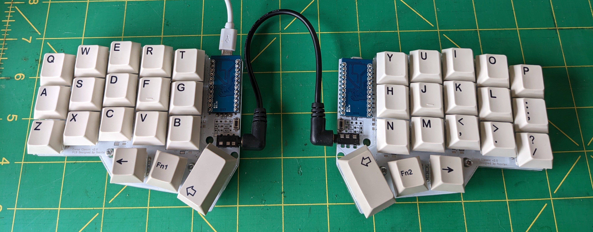

# Notes on my 36-key Corne Configuration

The Corne is a 42-key mechanical keyboard, but can be reduced to 36 keys. I try and use the same keymap where possible, but found that I really needed an _enter_ key on layer one, and so created this fork.

The Corne I'm using was ordered from [Mechboards](https://mechboards.co.uk/), and is a very minimal build. I wanted to see if using only 36 keys was possible, and so far it's definitely something I want to explore further.

This is what my keyboard currently looks like:

I'm currently using cheap Pro-micro clones, but I socketed them, so may like this enough to put better controllers in at some point soon. Apart from that, there's not much I would change.

The cheap controllers require QMK being told which bootloader to use. For me that command is:

    qmk flash -kb crkbd/rev1 -km teknostatik36 -bl avrdude