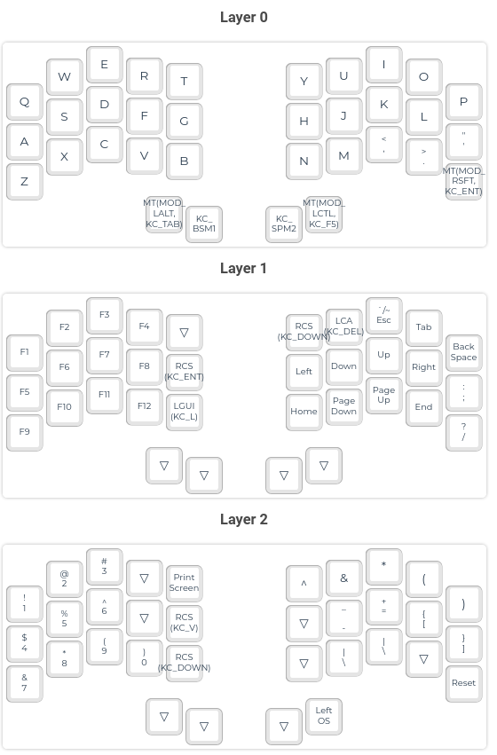

# Ferris Sweep

This is the Ferris Sweep from Mechboards, and when I built it there were some mismatched pins on the right hand side. So this firmware definitely won't work with most boards, but I thought it would at least be useful to document how I fixed it, and to post my work-in-progress keymap.

My keymap is mostly the same as the Corne, but I have had to combine two of my usual thumb cluster keys into one on both sides. It's surprisingly easy to get used to, and I may very well do something similar on other keyboards.

## Remapping the pins

This is what I have in my `config.h` to remap the pins so that what is in the keymap is actually what it typed.

    #undef DIRECT_PINS
    #define DIRECT_PINS { \
        { D7, F7, F6, F5, F4 }, \
        { B1, B3, B2, B6, D3 }, \
        { D1, D0, D4, C6, E6 }, \
        { B5, B4, NO_PIN, NO_PIN, NO_PIN } \
    }
    #undef DIRECT_PINS_RIGHT
    #define DIRECT_PINS_RIGHT { \
        { F4, F5, F6, F7, D7 }, \
        { D1, D3, B2, B3, B1 }, \
        { B4, E6, C6, B5, D0 }, \
        { B6, D4, NO_PIN, NO_PIN, NO_PIN } \
    }

It works well for this board, but should probably be removed for boards from other manufacturers.
