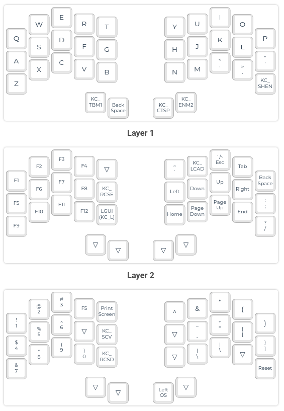
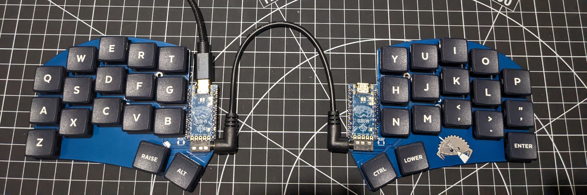

# Ferris Sweep

My keymap is mostly the same as the Corne, but I have had to combine two of my usual thumb cluster keys into one on both sides. It's surprisingly easy to get used to, and I may very well do something similar on other keyboards.

This is currently under very active development, so there is likely to be a mismatch between the image above and the actual keymap.

## Alternate firmware

I've also got a [custom build](https://github.com/teknostatik/keyboards/tree/main/ferris_sweep_mechboards) that works with the version of the Ferris Sweep from Mechboards.

## Build guide

I've been building a few of these with low profile switches and (mostly) blank key caps. I'm working on a [build guide](https://github.com/teknostatik/keyboards/blob/main/ferris_sweep/ferris_sweep_build_guide.md) which i will add to as I learn more.

