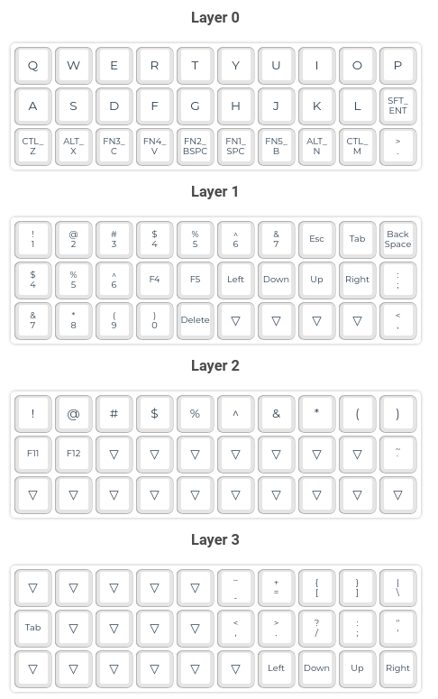

# Gherkin keymap

The Gherkin is a 30-key mechanical keyboard. 

The Gherkin I'm using was ordered from [Mechboards](https://mechboards.co.uk/), and was largely an experiment to see what I could achieve with such a small keyboard.

