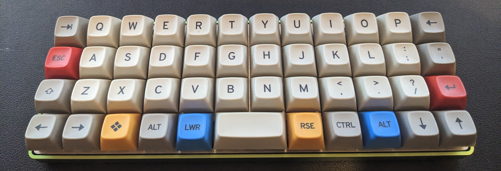

# QMK configuration files for my Plancks

This has been a bit of a journey, but I think I am getting there now. The Planck is the first ortholinear keyboard I built, and whilst it was an initial learning curve to use, it was actually a gateway drug to even smaller and stranger keyboards such as the Corne and the Gherkin.

My keymap is mostly the same as the Corne, in that every key that the two keyboards share does _exactly_ the same thing. This makes it very easy to type quickly, and puts modifiers and navigation back to where I now expect them to be. The outer keys on the bottom row are used to give easier access to navigation keys and modifiers, but I find I don't actually use them that much. The only thing this keyboard is _definitely_ better for is using on my work laptop (running Windows 10). The extra windows key and arrows are quite useful sometimes, although I have all these things on layer on my other keyboards so could adapt in not a lot of time at all.

There are still a couple more tweaks I want to experiment with, but in a push this could definitely be my main or only keyboard as it stands now. I'm still using this with Kailh Speed Coppers, which are still my favourite switch for actually typing on (especially when noise isn't a problem). I also have a silent Planck which mostly gets used at work, and also see the Planck as probably the best way to showcase the excellent MT3 keycaps from Drop.

