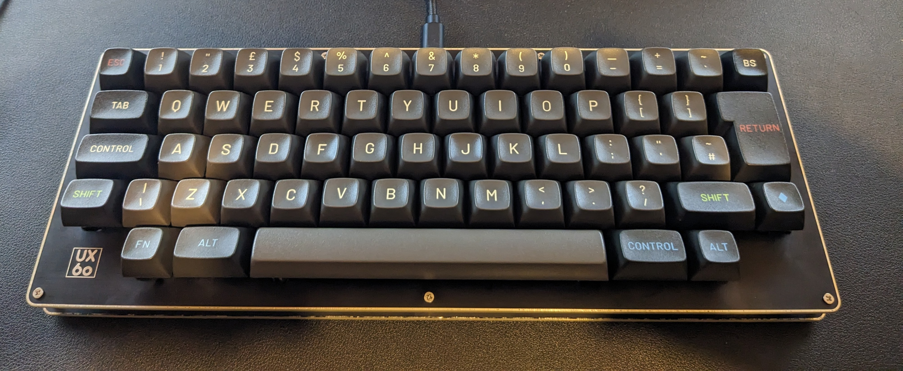

# Unix60

This is my first attempt building an ISO layout HHKb-inspired board. The board and case are the [Unix60 from 42 Keebs](https://42keebs.eu/shop/kits/pro-micro-based/unix60-ansi-iso-hhkb-60-black-green/), and it's controlled by an Elite-C.

This layout can be accommodated with any MT3 base kit, plus a 1U backspace key (or just use delete). this is a slightly weird layout that was a bit of an experiment, but that I definitely like.

What I am really pleased about is that the keymap I wrote for this keyboard just worked. And also that the way it is built I wouldn't need a new keymap if I decided to go for a 2U backspace or an ANSI enter key. That makes it a really good board to experiment with layouts on, although of course it would require de-soldering switches. I would definitely buy more of these, although I may go for better stabilisers to negate the slightly mushy sound and feeling I am getting at the moment.