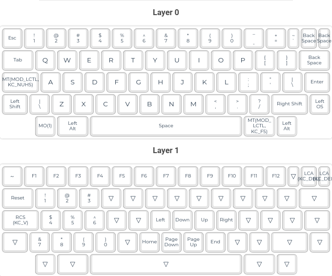

# Unix60

This is my first attempt building an ISO layout HHKB-inspired board. The board and case are the [Unix60 from 42 Keebs](https://42keebs.eu/shop/kits/pro-micro-based/unix60-ansi-iso-hhkb-60-black-green/), and it's controlled by an Elite-C.

This layout can be accommodated with the MT3 Susuwatari base kit (and probably most of the others). This is a slightly weird layout that was a bit of an experiment, but that I definitely like.

What I am really pleased about is that the keymap I wrote for this keyboard just worked. And also that the way it is built I wouldn't need a new keymap if I decided to go for a 2U backspace or an ANSI enter key. That makes it a really good board to experiment with layouts on, although of course it would require de-soldering. I would definitely buy more of these, although I may go for better stabilisers to negate the slightly mushy sound and feeling I am getting at the moment.

This is easily my favourite board that isn't a Corne or a Planck. I am very invested in trying to get hold of more of these and re-learning how to type on a non-ortho board. It's also a really cheap build for anyone who is looking to get into building keyboards, as it only has one controller and only needs about 60 switches (depending on keymap).